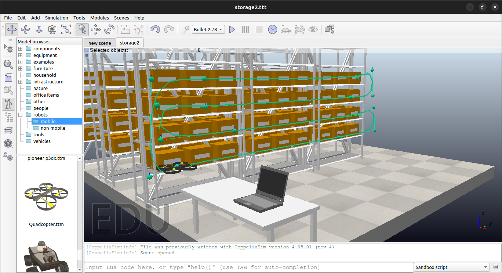

# Simulação
<!-- ## Descrição -->
  Simulação feita com objetivo de demonstrar como seria o funcionamento do projeto proposto.

# Instalação Coppeliasim 
  1. Baixe o arquivo [aqui](https://www.coppeliarobotics.com).
  2. Descompacte o arquivo.
  3. Na pasta descompactada execute o seguinte comando: 
```
./coppeliaSim
```

# Utilização
  Utilizando os modelos oferecidos no mesmo foi criada a cena da simulação.



Depois de montada a cena foram criados alguns scripts para que a simulação funcionasse como deveria. Sendo eles:


- quadcopter.lua
  - Utilizado pelo quadcopter.
  - Responsável por toda dinâmica do drone.

- proximitySensor.lua
  - Utilizado pelo sensor de proximidade que foi adicionado ao drone
  - Responsável por detectar objetos até 9cm de distância.
  
- target.lua
  - Utilizado pelo target do drone.
  - Responsável por percorrer o caminho criado.


#
  Versão utilizada: Coppeliasim 4.5.1